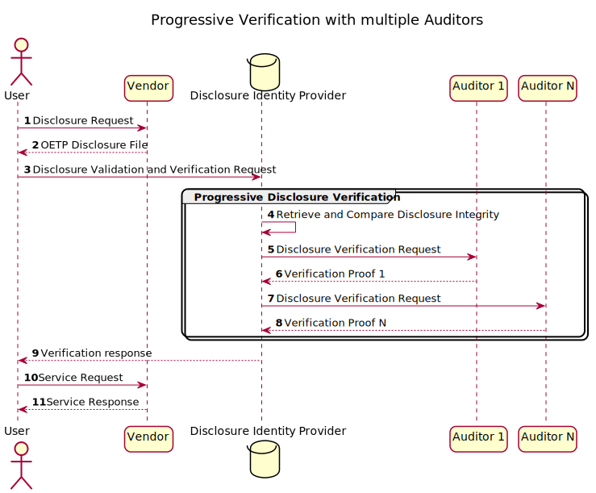
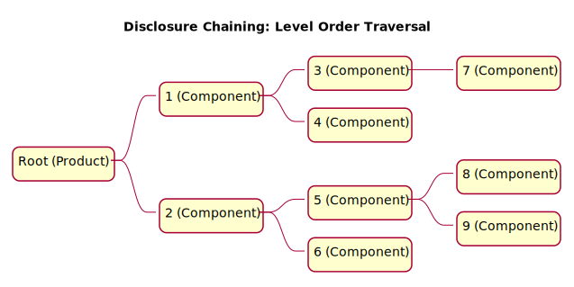

# Open Ethics Transparency Protocol <!-- omit in toc -->

## This repository <!-- omit in toc -->

This repository contains useful links, figures, and RFC-formatted version of The Open Ethics Transparency Protocol (OETP).

Structure: 

*/docs/* - Documentation.

*/examples/* - Examples of disclosures and associated labels.

*/templates/* - Current version of the Disclosure templates.

## Contents <!-- omit in toc -->
- [Introduction](#introduction)
- [Key Elements](#key-elements)
  - [Basic Disclosure Submission](#basic-disclosure-submission)
  - [Progressive Verification](#progressive-verification)
  - [Request for Supplier&#39;s Disclosures](#request-for-suppliers-disclosures)
  - [Disclosure Chaining: Level Order Traversal](#disclosure-chaining-level-order-traversal)
- [Links](#links)
- [How to contribute?](#how-to-contribute)

## Introduction

The Open Ethics Transparency Protocol (OETP or Protocol) describes the creation and exchange of voluntary ethics Disclosures for IT products. It is brought as a solution to increase the transparency of how IT products are built and deployed. This document provides details on how disclosures for data collection and data processing practice are formed, stored, validated, and exchanged in a standardized and open format.

OETP provides facilities for:

* **Informed consumer choices** : End-users able to make informed choices based on their own ethical preferences and product disclosure.
* **Industrial-scale monitoring** : Discovery of best and worst practices within market verticals, technology stacks, and product value offerings.
* **Legally-agnostic guidelines** : Suggestions for developers and product-owners, formulated in factual language, which are legally-agnostic and could be easily transformed into product requirements and safeguards.
* **Iterative improvement** : Digital products, specifically, the ones powered by artificial intelligence could receive nearly real-time feedback on how their performance and ethical posture could be improved to cover security, privacy, diversity, fairness, power balance, non-discrimination, and other requirements.
* **Labeling and certification** : Mapping to existing and future regulatory initiatives and standards.

The Open Ethics Transparency Protocol (OETP) is an application-level protocol for publishing and accessing ethical Disclosures of IT Products and their Components. The Protocol is based on HTTP exchange of information about the ethical &quot;postures&quot;, provided in an open and standardized format. The scope of the Protocol covers Disclosures for systems such as Software as a Service (SaaS) Applications, Software Applications, Software Components, Application Programming Interfaces (API), Automated Decision-Making (ADM) systems, and systems using Artificial Intelligence (AI). OETP aims to bring more transparent, predictable, and safe environments for the end-users. The OETP Disclosure Format is an extensible JSON-based format.

## Key Elements

### Basic Disclosure Submission

### Progressive Verification

### Request for Supplier&#39;s Disclosures

### Disclosure Chaining: Level Order Traversal

## Links

[draft-lukianets-open-ethics-transparency-protocol.md](draft-lukianets-open-ethics-transparency-protocol.md) - Protocol documentation (work in progress)

[https://openethicsai.github.io/OETP/](https://openethicsai.github.io/OETP/) - Preview of the Protocol documentation generated using Martin Thomson's [i-d-template](https://github.com/martinthomson/i-d-template).

[docs/diagrams/images](docs/diagrams/images/) - SVG versions of the PUML files for Figures

[https://openethics.ai/oetp/](https://openethics.ai/oetp/) - The Official project webpage on the Open Ethics website.

[https://openethics.ai/label/](https://openethics.ai/label/) - The labeling webpage to perform the initial Disclosure.

[https://openethics.ai/manifesto/](https://openethics.ai/manifesto/) - The Open Ethics Manifesto.

[https://github.com/OpenEthicsAI/OETP-RI-scheme](https://github.com/OpenEthicsAI/OETP-RI-scheme) - URI scheme

## How to contribute?
You can contribute by submitting your comments and by making pull requests to [this repository](https://github.com/OpenEthicsAI/OETP).

Automated numbering and TOC generation for the non-IETF docs could be done using free [Markdown All in One
](https://marketplace.visualstudio.com/items?itemName=yzhang.markdown-all-in-one
) extension for the [Visual Studio Code](https://code.visualstudio.com/).

Diagrams in SVG are stored in [docs/diagrams/images](docs/diagrams/images/) and are built from `*.puml` files in [docs/diagrams/src](docs/diagrams/src/) automatically with [PlantUML](https://plantuml.com/)
