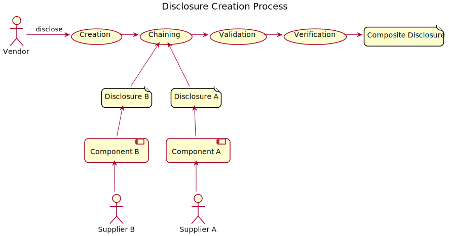
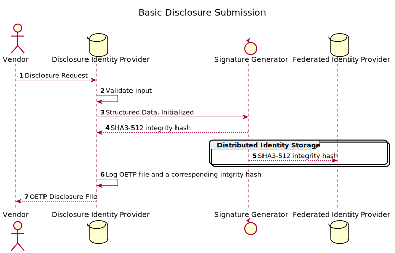
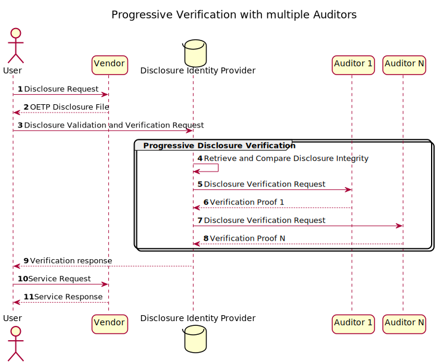
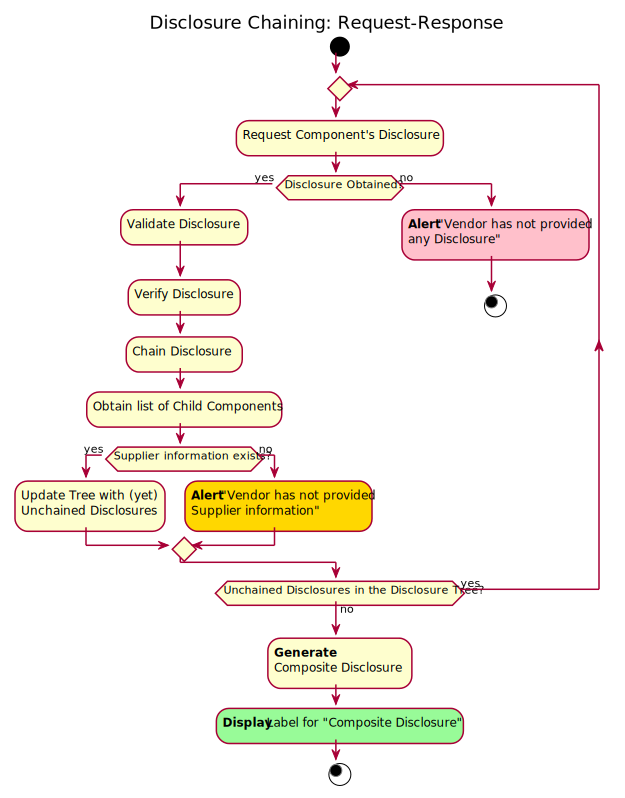
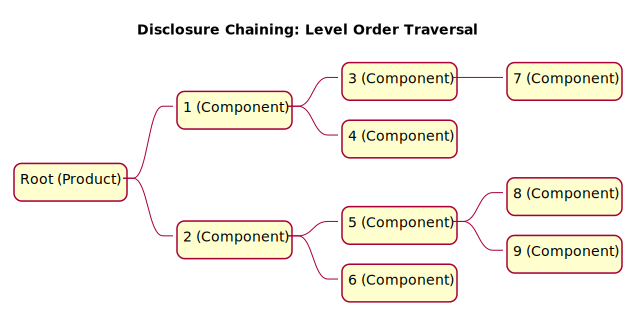

# Open Ethics Transparency Protocol - Internet Draft  <!-- omit in toc -->

Version: 0.9.3

Format: [IETF](https://www.ietf.org/) Request for Comments (RFC)

State: [Internet Draft](https://www.ietf.org/standards/ids/)

Last update: 2021-11-18

Authors: Nikita Lukianets

***

## Status of this Memo  <!-- omit in toc -->

This document is the Internet Draft, it contains a Proposed Standard description for the Internet community, and requests discussion and suggestions for improvements.

This document is planned to be brought in accordance with the RFC publication requirements for the Internet Standards Track protocol as described in [RFC322](https://www.rfc-editor.org/rfc/rfc7322) and [RFC841](https://www.rfc-editor.org/rfc/rfc7841).

Information about the current status of this document, any errata, and how to provide feedback on it may be obtained at [https://openethics.ai/oetp/](https://openethics.ai/oetp/).

## Copyright Notice <!-- omit in toc -->

Copyright (C) 2020-2021 Open Ethics and the persons identified as the document authors. All Rights Reserved.

## Abstract <!-- omit in toc -->

The Open Ethics Transparency Protocol (OETP) is an application-level protocol for publishing and accessing ethical Disclosures of IT Products and their Components. The Protocol is based on HTTP exchange of information about the ethical &quot;postures&quot;, provided in an open and standardized format. The scope of the Protocol covers Disclosures for systems such as Software as a Service (SaaS) Applications, Software Applications, Software Components, Application Programming Interfaces (API), Automated Decision-Making (ADM) systems, and systems using Artificial Intelligence (AI). OETP aims to bring more transparent, predictable, and safe environments for the end-users. The OETP Disclosure Format is an extensible JSON-based format.

***

## Contents  <!-- omit in toc -->

- [1. Introduction](#1-introduction)
- [2. Requirement Levels](#2-requirement-levels)
- [3. Terminology](#3-terminology)
  - [3.1. Disclosure](#31-disclosure)
  - [3.2. Disclosure Feed](#32-disclosure-feed)
  - [3.3. Vendor](#33-vendor)
  - [3.4. Integrator](#34-integrator)
  - [3.5. Product](#35-product)
  - [3.6. Component](#36-component)
  - [3.7. Upstream Component](#37-upstream-component)
  - [3.8. Downstream Component](#38-downstream-component)
  - [3.9. Automated Decision-Making (ADM)](#39-automated-decision-making-adm)
  - [3.10. OETP Disclosure Format](#310-oetp-disclosure-format)
  - [3.11. Validation](#311-validation)
  - [3.12. Auditor](#312-auditor)
  - [3.13. Auditing software](#313-auditing-software)
  - [3.14. Verification](#314-verification)
  - [3.15. Verification Proof](#315-verification-proof)
  - [3.16. Chaining](#316-chaining)
  - [3.17. Label](#317-label)
- [4. Protocol Model](#4-protocol-model)
  - [4.1. Creation of the Disclosure](#41-creation-of-the-disclosure)
    - [4.1.1. Cryptographic Signature](#411-cryptographic-signature)
    - [4.1.2. Immutable Storage](#412-immutable-storage)
    - [4.1.3. Visual Labeling](#413-visual-labeling)
  - [4.2. Access to Disclosure](#42-access-to-disclosure)
    - [4.2.1. Initial Request to a Disclosure file](#421-initial-request-to-a-disclosure-file)
    - [4.2.2. Access to Visual Trust Labels](#422-access-to-visual-trust-labels)
    - [4.2.3. Requirements for placement of Integrity Signature in Visual Label](#423-requirements-for-placement-of-integrity-signature-in-visual-label)
    - [4.2.4. Conformity assessment marks](#424-conformity-assessment-marks)
  - [4.3. Verification and Validation of Disclosure](#43-verification-and-validation-of-disclosure)
    - [4.3.1. Automated Disclosure processing](#431-automated-disclosure-processing)
    - [4.3.2. Validation of Vendor&#39;s Disclosures](#432-validation-of-vendors-disclosures)
    - [4.3.3. Verification of Vendor&#39;s Disclosures](#433-verification-of-vendors-disclosures)
    - [4.3.4. Progressive Verification](#434-progressive-verification)
  - [4.4. End-to-end transparency and formation of the composite Disclosure](#44-end-to-end-transparency-and-formation-of-the-composite-disclosure)
    - [4.4.1. Open Supplier Policy](#441-open-supplier-policy)
    - [4.4.2. Request for Supplier&#39;s Disclosures](#442-request-for-suppliers-disclosures)
    - [4.4.3. Disclosure Chaining](#443-disclosure-chaining)
- [5. Example OETP Disclosure File](#5-example-oetp-disclosure-file)
- [6. Security Considerations](#6-security-considerations)
  - [6.1. Response content](#61-response-content)
  - [6.2. Spoofing](#62-spoofing)
  - [6.3. Falsification](#63-falsification)
- [7. IANA Considerations](#7-iana-considerations)
- [8. Areas for Future Study](#8-areas-for-future-study)
- [9. References](#9-references)
  - [9.1. Normative References](#91-normative-references)
  - [9.2. Informative References](#92-informative-references)
- [10. Author&#39;s Address](#10-authors-address)

## 1. Introduction

The Open Ethics Transparency Protocol (OETP or Protocol) describes the creation and exchange of voluntary ethics Disclosures for IT products. It is brought as a solution to increase the transparency of how IT products are built and deployed. This document provides details on how disclosures for data collection and data processing practice are formed, stored, validated, and exchanged in a standardized and open format.

OETP provides facilities for:

* **Informed consumer choices** : End-users able to make informed choices based on their own ethical preferences and product disclosure.
* **Industrial-scale monitoring** : Discovery of best and worst practices within market verticals, technology stacks, and product value offerings.
* **Legally-agnostic guidelines** : Suggestions for developers and product-owners, formulated in factual language, which are legally-agnostic and could be easily transformed into product requirements and safeguards.
* **Iterative improvement** : Digital products, specifically, the ones powered by artificial intelligence could receive nearly real-time feedback on how their performance and ethical posture could be improved to cover security, privacy, diversity, fairness, power balance, non-discrimination, and other requirements.
* **Labeling and certification** : Mapping to existing and future regulatory initiatives and standards.

The Open Ethics Transparency Protocol (OETP) is an application-level protocol for publishing and accessing ethical Disclosures of IT products and their components. The Protocol is based on HTTP exchange of information about the ethical &quot;postures&quot;, provided in an open and standardized format. The scope of the Protocol covers Disclosures for systems such as Software as a Service (SaaS) Applications, Software Applications, Software Components, Application Programming Interfaces (API), Automated Decision-Making (ADM) systems, and systems using Artificial Intelligence (AI). OETP aims to bring more transparent, predictable, and safe environments for the end-users. The OETP Disclosure Format is an extensible JSON-based format.

## 2. Requirement Levels

The key words &quot;MUST&quot;, &quot;MUST NOT&quot;, &quot;REQUIRED&quot;, &quot;SHALL&quot;, &quot;SHALL NOT&quot;, &quot;SHOULD&quot;, &quot;SHOULD NOT&quot;, &quot;RECOMMENDED&quot;, &quot;MAY&quot;, and &quot;OPTIONAL&quot; in this document are to be interpreted as described in [RFC 2119](https://www.rfc-editor.org/rfc/rfc2119).

## 3. Terminology

### 3.1. Disclosure

Disclosure (Ethics Disclosure, or self-disclosure) is application-specific information about the data collection, data-processing, and decision-making practices of a Product, provided by the Product Vendor (an individual developer or an organization).

### 3.2. Disclosure Feed

A historical sequence of Disclosures, made for a specific Product.

### 3.3. Vendor <!-- no toc -->

A legal person (an individual developer or an organization) that owns one or several end-user Products, or acts as a Supplier and provides Components for other Vendors.

### 3.4. Integrator

A legal person (an individual developer or an organization) that deploys technology-powered services to the end-users based on Product(s) from third-party Vendors.

### 3.5. Product

An IT system in the form of software, software as a service system, application, software component, application programming interface, or a physically embodied automated decision-making agent.

### 3.6. Component

An IT system supplied by Vendor and integrated/embedded into end-user Products. Components themselves do not necessarily interface with end-users.

### 3.7. Upstream Component

A Component that sends its outputs to the Product Downstream in the data processing chain. Disclosure for the Upstream Component is represented as a Child relative to the Disclosure node of the Downstream Product.

### 3.8. Downstream Component

A Component that receives inputs from the Components Upstream in the data processing chain. Disclosure for the Downstream Component is represented as a Parent relative to the Disclosure node of the Upstream Component.

### 3.9. Automated Decision-Making (ADM)

The automated decision-making is the process of making a decision by automated means without any human involvement. These decisions can be based on factual data, as well as on digitally created profiles or inferred data.

### 3.10. OETP Disclosure Format

A machine-readable Disclosure with predefined structure, supplied in the JSON format.

### 3.11. Validation

A sequence of automated software-based checks to control validity and security elements in the OETP Disclosure.

### 3.12. Auditor

A third-party legal person trusted to perform Verification checks and to issue Verification Proofs.

### 3.13. Auditing software

An automated software-based tool authorized to perform Verification checks and to issue Verification Proofs.

### 3.14. Verification

A procedure to control the correspondence of the elements in the OETP Disclosure and the actual data processing and data collection practices of the Vendors.

### 3.15. Verification Proof

A result of the formal Disclosure Verification procedure presented to a requestor.

### 3.16. Chaining

A process of combining Disclosures of individual Components into a composite high-level Disclosure for a Product.

### 3.17. Label

User-facing graphical illustrations and textual descriptions of the Product that facilitate understanding of the values and risks the Product carries.

## 4. Protocol Model

The Disclosure creation and delivery consist of the two parts, starting from (I) the submission of the Disclosure form, chaining of the Suppliers' Disclosures, Signature of the disclosed information, and to the delivery part (II) that first checks that the Disclosure is Valid, and then that the information specified in it is Verified by the third-parties.



### 4.1. Creation of the Disclosure

The initial Disclosure is created by filling a standardized disclosure form (for example, see 1. [https://openethics.ai/label/](https://openethics.ai/label/)). A Vendor representative, a Product Owner, or a Developer, MUST submit data-processing and data-collection information about the Product. The information about the end-point URL, as well as a contact email address, MUST be specified. Disclosure MAY also be created in a fully automated way as a part of the CI/CD DevOps pipeline.



#### 4.1.1. Cryptographic Signature

The Disclosure is organized into a predefined data schema and MUST be cryptographically signed by the Signature Generator (Open Ethics or federated providers) using standard SHA3-512 hash implementation. The integrity hash MUST be appended to a disclosure as the `OETP.schema.integrity` element.

#### 4.1.2. Immutable Storage

Both the signature integrity hash and the Disclosure SHOULD be stored in the log-centric root database and MAY be mirrored by other distributed databases for redundancy and safety.

#### 4.1.3. Visual Labeling

Open Ethics Label SHOULD be automatically generated by mirroring the submitted Disclosure into a set of graphical icons and simple human-readable descriptions. Additional Labels MAY be generated following successful third-party Verification and by mapping the regulatory requirements to Verified Disclosures.

### 4.2. Access to Disclosure

#### 4.2.1. Initial Request to a Disclosure file

The most recent OETP file SHOULD be stored in the root of the Product's specified end-point URL, allowing requests to the OETP file from third-party domains. When establishing a Vendor relationship, the Integrator or a downstream Vendor MAY examine the Disclosure for their Components using the following HTTP request: `GET https://testexample.com/oetp.json`, where *testexample.com* is the URL of the Supplier&#39;s end-point.

#### 4.2.2. Access to Visual Trust Labels

A Vendor SHOULD place a visual Label generated as a result of the Disclosure process in the Product informational materials (for example Marketing Materials, User Guides, Safety Instructions, Privacy Policy, Terms of Service, etc). The Label reflects the content of the Disclosure and SHOULD be displayed in any digital media by embedding a software widget. Visual labels in the print media SHOULD carry a visually distinguishable Integrity signature to enable manual Validation by the User.

#### 4.2.3. Requirements for placement of Integrity Signature in Visual Label

* **Labels in the online digital media** MUST be generated automatically based on the content of the Disclosure and MUST contain a URL allowing to check the complete Integrity hash and explore more detailed information about the Disclosure.
* **Labels in the offline media** MUST be generated automatically based on the content of the Disclosure and should carry the first 10 digits of the corresponding Integrity hash.

#### 4.2.4. Conformity assessment marks

Based on the Verification performed for the OETP Disclosure file, the labels MAY include Conformity assessment marks, Certification marks, as well as marks showing adherence to certain standards. These marks MAY be generated and displayed automatically based on the Verification Proofs.


### 4.3. Verification and Validation of Disclosure

#### 4.3.1. Automated Disclosure processing

The automated Disclosure processing is enabled by requests to both the Open Ethics Disclosure database powered by Disclosure Identity Providers and the Product's OETP Disclosure file.

#### 4.3.2. Validation of Vendor&#39;s Disclosures

The OETP Processing system MUST compare integrity hashes in the Open Ethics Disclosure database and entries that arrive as a result of the Disclosure Request response.

#### 4.3.3. Verification of Vendor&#39;s Disclosures

Every disclosure SHOULD be checked for the existence of the external Verification from Auditors for the entire Disclosures or one of Disclosure elements.

#### 4.3.4. Progressive Verification

To raise a level of trust to a Disclosure, a Vendor MAY decide to opt-in for a third-party Disclosure Verification. OETP suggests a Progressive Verification scheme where multiple independent external Verification Proofs COULD be issued by third parties to confirm the information specified in the Disclosure.

The Progressive Verification applies to a whole Disclosure, or to specific elements of the Disclosure.

The diagram below displays a general scheme for Disclosure requests and responses.



The following elements MAY serve as sources for various kinds of Verification proofs:
* Qualified Auditor reports
* Qualified Vendor of Auditing software tests
* Certification Authority assessments
* Conformity assessments
* User Feedback
* Market Brokers
* Real-time Loggers

### 4.4. End-to-end transparency and formation of the composite Disclosure

IT industry is getting more mature with Vendors becoming more specialized. Surface-level transparency is not sufficient as a supply chain is becoming more complex and distributed across various Components. The following steps MUST be satisfied for the end-to-end transparency:

#### 4.4.1. Open Supplier Policy

Every Integrator or a Vendor SHOULD disclose the information about their Suppliers (sub-processing Vendors), indicating the scope of the data processing in the Components they provide. 

If the Supplier information is not provided, Disclosure SHOULD contain information that a Vendor (Integrator) has not provided Supplier information.

##### 4.4.1.1. First-party Components
For greater transparency, Vendors may decide to reveal Components even if they originate from themselves (first-party Components). For the first-party Component, the Supplier identity information SHOULD NOT be provided because it was already disclosed earlier.

Required: [Component information](#44132-component-information) only

##### 4.4.1.2. Third-party Components

When disclosing Components originating from the third-party Vendors SHOULD provide both the Supplier identity information and Component information

Required: [Supplier identity](#44131-supplier-identity)+[Component information](#44132-component-information)

##### 4.4.1.3. Elements of Supplier disclosure

###### 4.4.1.3.1. Supplier identity
* Vendor Name
* Vendor URL
* Vendor ID
* Vendor DPO Contact Email

###### 4.4.1.3.2. Component information
* Component Scope of use
* Personal Data Being Processed by Component
* Is a Safety Component [YES]/[NO]
* Component URL (if different from the Vendor URL)
* Component Disclosure URL (if different from the default `Component URL/oetp.json`)
* Component DPO Contact (if different from Vendor DPO Contact Email)

#### 4.4.2. Request for Supplier&#39;s Disclosures

The OETP Processing system MUST send GET requests to the URLs of each Component to obtain their Disclosures. Based on the response to each Disclosure request, the OETP Processing system MUST specify which Components have Disclosures and which don't have Disclosures.



#### 4.4.3. Disclosure Chaining

The same Request-response operation applies recursively for Components of the Components, and for the Components of the Components of the Components, etc. It is proposed to view the supply chain as a tree-like hierarchical data structure, where the information about Components is assembled using Level Order Tree Traversal algorithm.

In this tree:
* Node is a structure that contains Component's Disclosure;
* Root is the top Node representing a Product's Disclosure information;
* Edge is the connection between one Node and another, representing the scope of the Data Processing by the Component.




## 5. Example OETP Disclosure File

```yaml
{
    "schema": {
        "name": "Open Ethics Transparency Protocol",
        "version": "0.9.3 RFC",
        "integrity": "156d624b8f2dbea87128a2147f255842652475c5dc595c79f64c90c7ff486d59007c3e18c993e3163395812e26b70ea70dfc413f7ca128869d115f12e5699bf2"
    },
    "snapshot": {
        "product": {
            "url": "testexample.com",
            "description": ""
        },
        "timestamp": 1608273946,
        "generator": {
            "name": "Open Ethics",
            "alias": "oe",
            "type": "root",
            "website": "https://openethics.ai"
        },
        "label": {
            "data": {
                "type": "open",
                "practice": ""
            },
            "source": {
                "type": "open",
                "practice": ""
            },
            "decision": {
                "type": "restricted",
                "practice": ""
            }
        }
    }
}
```

## 6. Security Considerations

### 6.1. Response content

OETP exchanges data using JSON ([RFC159](https://www.rfc-editor.org/rfc/rfc7159)) which is a lightweight data-interchange format. A JSON-based application can be attacked in multiple ways such as sending data in an improper format or embedding attack vectors in the data. It is important for any application using JSON format to validate the inputs before being processed. To mitigate this attack type, the JSON Key Profile is provided for OETP responses.

### 6.2. Spoofing

OETP Processors should be aware of the potential for spoofing attacks where the attacker publishes an OETP disclosure with the `OETP.snapshot` value from another product, or, perhaps with an outdated `OETP.snapshot.label` element. For example, an OETP Processor could suppress the display of falsified entries by comparing the snapshot integrity from the submission database and a calculated hash for the `OETP.snapshot` object. In that situation, the OETP Processor might also take steps to determine whether the disclosures originated from the same publisher require further investigation of the Disclosure Feed and alert the downstream OETP Processors.

### 6.3. Falsification

Dishonest or falsified Disclosures is a problem that is hard to address generally. The approach to it is public control and systematic checks. Vendors or user-facing applications and services could further raise the level of trust in their Disclosures by implementing programmatic control scoring mechanisms, as well as the external verification by trusted Auditors.

## 7. IANA Considerations

This document has no IANA actions.

## 8. Areas for Future Study

The following topics not addressed in this version of LDP are possible areas for future study:

* IANA requests for the Data Processor identity management.
* Extensibility of the OETP Disclosure Format.
* Disclosure Chaining mechanisms and various use-cases.
* Typical scenarios and templates for Disclosure submissions.
* Mapping of the regulatory requirements and future Disclosure elements.
* Standardizing Privacy Disclosure and PII data-collection practices.

## 9. References

### 9.1. Normative References

* TBD

### 9.2. Informative References

* The JavaScript Object Notation (JSON) Data Interchange Format [https://www.rfc-editor.org/rfc/rfc7159](https://www.rfc-editor.org/rfc/rfc7159)
* RFC Style Guide [https://www.rfc-editor.org/rfc/rfc7322](https://www.rfc-editor.org/rfc/rfc7322)
* RFC Streams, Headers, and Boilerplates [https://www.rfc-editor.org/rfc/rfc7841](https://www.rfc-editor.org/rfc/rfc7841)

## 10. Author&#39;s Address

Nikita Lukianets

[n.lukianets@openethics.ai](mailto:n.lukianets@openethics.ai)